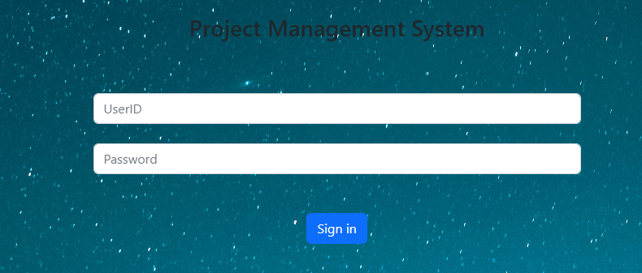
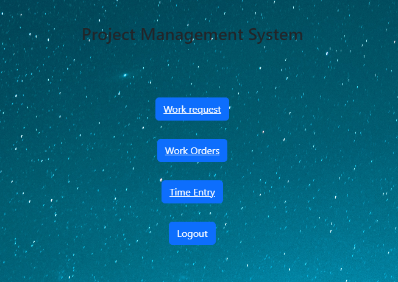
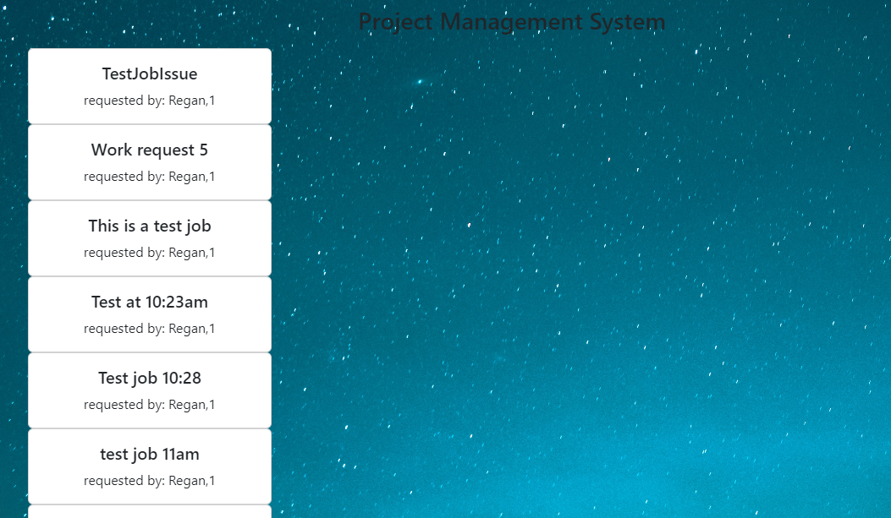
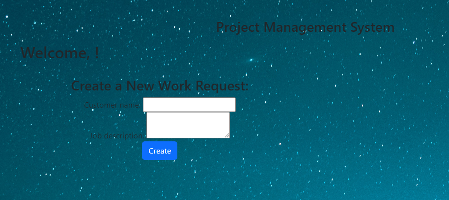
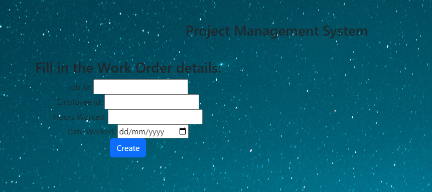

  
# Project Management System
  [](https://opensource.org/licenses/MIT)

  A project system that allows both customers and staff monitor jobs, time and other reporting as required. The system uses node.js, express, handlebars, sequilize and bcrypt to capture, store, protect and retrieve information.


  [A deployed version can be viewed here.](n/a)

  [The repository can be viewed here.](https://github.com/dgourley84/ProjectManagementSystem)

  ---
## Contents
1. [About](#about)
    1. [Usage](#usage)
    2. [User Story](#user-story)
    3. [Acceptance criteria](#acceptance-criteria)
    4. [Visuals](#visuals)
2. [Installation](#installation)
3. [License](#license)
4. [Contributing](#contributing)
5. [Tests](#tests)
6. [Authors and acknowledgment](#authors-and-acknowledgments)
7. [Questions](#questions)
---
## About

  A project system that allows both customers and staff monitor jobs, time and other reporting as required. The system uses node.js, express, handlebars, sequilize and bcrypt to capture, store, protect and retrieve information.

  The application allows a user to create jobs requests, enter time, view jobs, and view time entries.

---
## Usage
  
Open the app at the following URL and use it as you please. 

Alternatively, you can run the program locally by cloning this repository, adding your credentials to the .env.EXAMPLE file, and initializing the database in the terminal.
  

---
## User Story
  
  Create an app that allows users to create work requests and monitor their progress, as well as allowing an employee to access and record time against the same jobs.

---
## Acceptance Criteria
  
  When a user arrives on the home page they are presented with the option to login.
  When logging in the user is directed to a homepage depending on their user type - either employee or customer.
  As a customer, a user has the ability to create work requests and view current work status.
  As an employee, a user has the ability to create work requests, create time entries on work orders and view the current listing of both jobs and time entries.
    
---
## Visuals:

  
  
  
  
  
---
## Installation:
  To install and run this application yourself follow the steps(s) below:
  ```bash
  npm i
  ```
  To seed the file with user data
  ```bash
  node seeds/seed
  ```
---
## License
  License used for this project - MIT
  * For more information on license types, please reference this website
  for additional licensing information - [https: //choosealicense.com/](https://choosealicense.com/).
---

## Contributing:

  To contribute to this application, create a pull request.
  Here are the steps needed for doing that:
  - Fork the repo
  - Create a feature branch (git checkout -b NAME-HERE)
  - Commit your new feature (git commit -m 'Add some feature')
  - Push your branch (git push)
  - Create a new Pull Request
  Following a code review, your feature will be merged.

---

## Tests:

  This app does not have any tests.

---
## Authors & Acknowledgments

  - Dallas Gourley
  - Vanessa Olier
  - Satya Selvan 

---

## Questions:
* GitHub Username: [dgourley84](https://github.com/dgourley84)
* GitHub Username: [selvan92](https://github.com/Selvan92)
* GitHub Username: [vpolier](https://github.com/vpolier)


